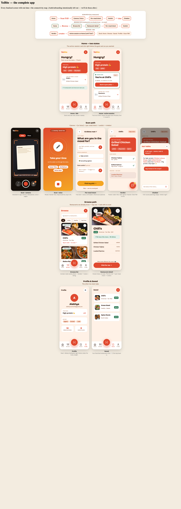
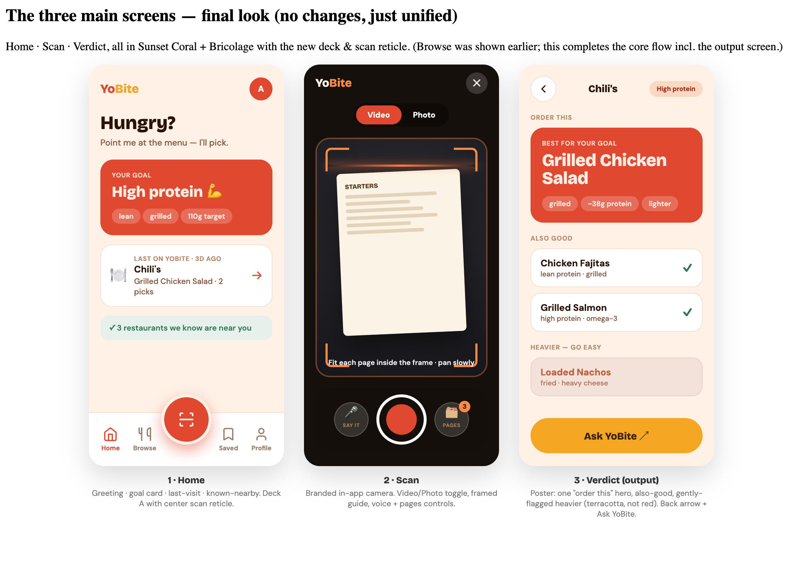
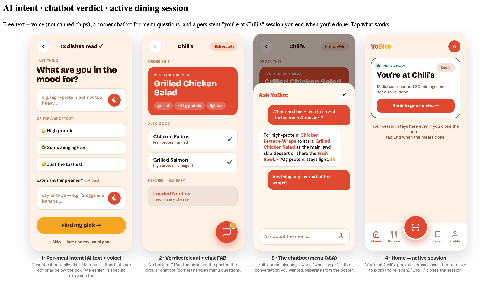
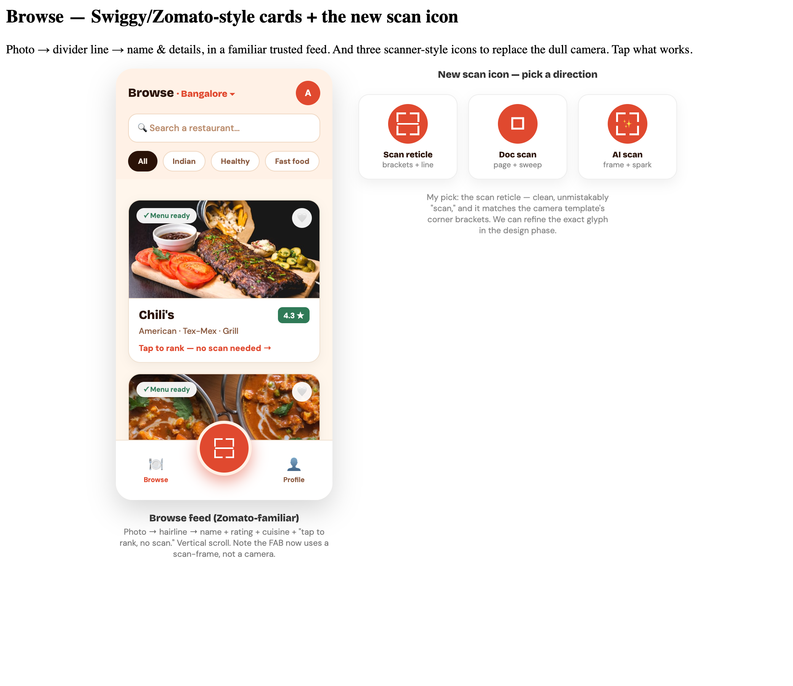
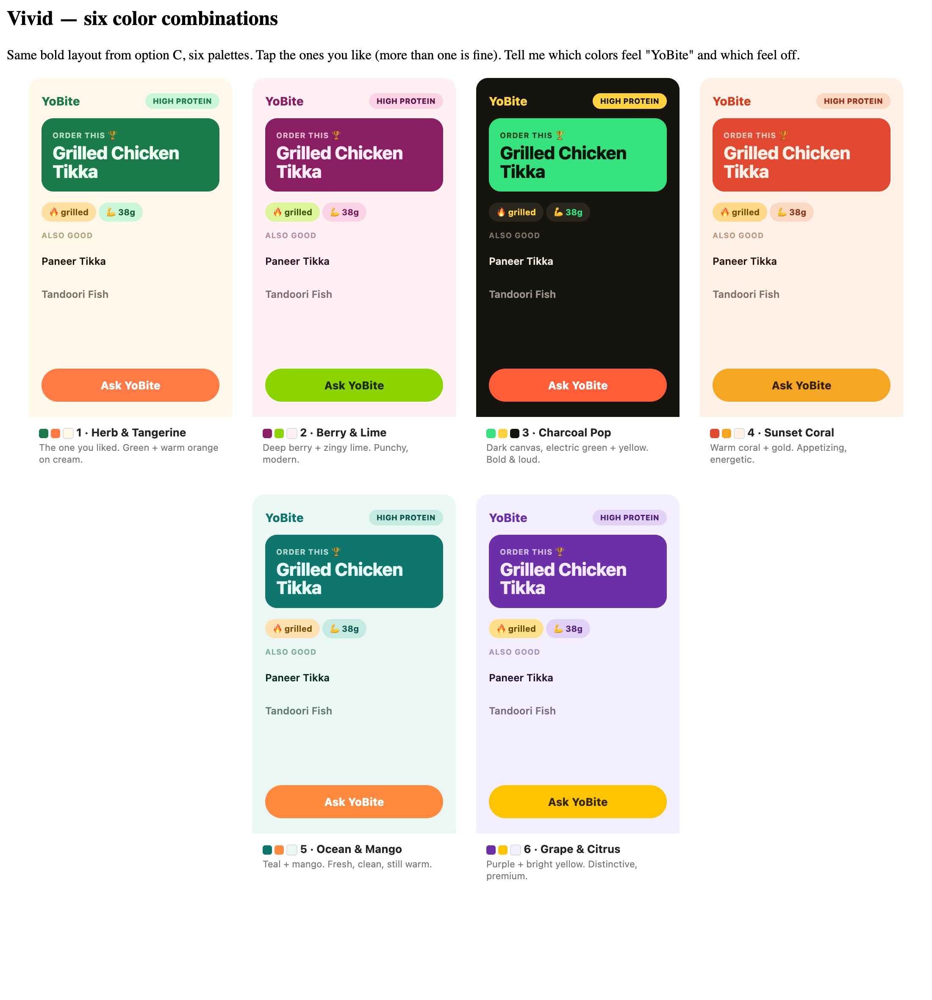

<div align="center">

# 🍽️ YoBite

**Scan a restaurant's menu, tell it your goal, get one confident "order this" — with reasons.**
A *ranker*, not a calorie calculator.

> **North star:** *"The menu should not flesh in my mind."*
> Fast, calm, decisive — get one good answer and get back to the table.
> Built for the **local restaurant** where the diner is actually confused, not the chain they already know.

</div>

---

## The whole app at a glance



---

## What it is

A mobile-first PWA (with a native iOS/Android app planned). You point it at any menu —
**film it, photograph it, or say it out loud** — tell it what you're in the mood for *this
meal*, and it hands back a **poster verdict**: one best pick, a few "also good," and gently
flagged "heavier" choices, each with an honest *why*. No order is ever placed; it's a
suggestion that gets you decided in seconds.

It's deliberately built for **presence, not engagement** — no streaks, no feed to scroll, no
daily-login loops. The best session is the shortest one.

---

## Design

YoBite v2 is **"Vivid"** — bold color blocks, big type, expressive — in the **Sunset Coral**
palette with **Bricolage Grotesque + DM Sans**. (The full design system lives in
[`DESIGN.md`](DESIGN.md).)

| Home · Scan · Verdict | Per-meal intent · Chatbot · Active session |
|---|---|
|  |  |

| Browse (your saved restaurants) | Palette exploration |
|---|---|
|  |  |

**Design system in one line:** coral `#E0492F` · gold `#F5A623` · peach canvas `#FFF1E6` ·
warm ink `#2A1207` · terracotta `#BE5E3D` for "heavier" (informs, never scolds — never
stop-sign red).

---

## How it works

### The flow
```
Home ──(Scan)──> Camera / Voice ──> "What are you in the mood for?" ──> Verdict ⇄ Chatbot
Home ──(Browse)─> a restaurant you've saved ──────────────────────────> Verdict   (no re-scan)
```
Scanning a place starts an **active dining session** that lives on your home screen and
persists across closing the app — reopen and you're back at your picks instantly, until you
tap **End**.

### The ranking brain — `lib/ranker/`
A transparent, deterministic engine that reads the *dish name*:
```
parse → classify → score → bucket → reasons
```
- **`parse.ts`** — menu text → clean dish names (strips prices, headers, dotted leaders).
- **`knowledge.ts`** — food token tables: cooking methods (lean/fried/rich), proteins with
  gram estimates, refined carbs, veg/dessert/drink. Indian & Indo-Chinese first.
- **`classify.ts` / `score.ts`** — name → honest `DishProfile`, then per-goal weighting.
- **`reasons.ts`** — the honest "why" (*"Grilled, high protein, lighter on refined carbs"*)
  instead of a fake-precise calorie count.

In v2 an LLM **reads** the menu image and **grounds** the nutrition reasoning, but the
deterministic ranker still does the scoring — so verdicts stay fast, explainable, and testable.

---

## Architecture (v2, scope: focused v1 + accounts)

```
        [ PWA — Next.js 15 / React 19 ]      (native iOS/Android later, same backend)
   Home · Scan · Intent · Verdict · Chatbot · Browse · Saved · Profile
                     │ HTTPS
                     ▼
     [ Serverless API routes ]  ← hold all AI keys (never in the browser)
        /api/scan  → vision LLM: menu image → dish[]
        /api/rank  → lib/ranker (deterministic) + LLM "why"
        /api/chat  → LLM: menu Q&A grounded in the session's dishes
            │                                   │
            ▼                                   ▼
   [ Supabase ]                          [ AI providers ]
     Auth (Google / phone-OTP)            Gemini Flash (free) — primary
     Postgres (profiles, sessions,        OpenRouter / Qwen-VL — fallback
       menus, history), Storage
```

- **AI is free-tier by design** (Gemini Flash primary, OpenRouter fallback) behind a
  swappable provider abstraction — quality without spend, until validated.
- Full design + architecture decisions:
  [`docs/superpowers/specs/2026-06-06-yobite-v2-redesign-design.md`](docs/superpowers/specs/2026-06-06-yobite-v2-redesign-design.md).

---

## Tech stack

Next.js 15 (App Router) · React 19 · TypeScript · CSS Modules · Vitest · PWA (`app/manifest.ts`).
Planned: Supabase (auth + Postgres + storage) · Gemini Flash / OpenRouter for vision + chat.

## Run it

```bash
npm install
npm run dev      # http://localhost:3000  (mobile-first — open via the Network URL on a phone)
npm test         # ranking-brain test suite (vitest)
npm run build    # production build
```

### AI keys (free tier)

The scan + rank pipeline calls a vision model. Copy `.env.example` to `.env.local` and add
at least one key (both have free tiers, no card):

- `GEMINI_API_KEY` — primary (Gemini Flash). https://aistudio.google.com/apikey
- `OPENROUTER_API_KEY` — fallback (Qwen-VL). https://openrouter.ai/keys

Unit tests mock the providers and need no keys. The live integration test
(`lib/ai/integration.test.ts`) runs only when an AI key is set **and** a sample photo
exists at `lib/ai/fixtures/menu.jpg`; otherwise it skips.

## Project structure

```
app/        Next.js routes (landing, scan, order) + globals.css design tokens
lib/ranker/ the deterministic ranking brain (+ tests)
lib/        ocr, voice, store helpers
components/ shared UI (Logo, …)
docs/       design spec + design screenshots
DESIGN.md   the visual source of truth
```

## Status & roadmap

- ✅ **v1 baseline** built (offline heuristic ranker, 3 screens, 28 tests green).
- 🎨 **v2 redesign** — design complete, architecture locked (see the spec). Now building:
  new design system → vision-AI scan → grounded ranking → chatbot → active sessions → auth.
- ⏭️ **Later:** curated restaurant-menu library (Browse), video scanning, native apps.

---

<div align="center">
<sub>Built with care. A decider, not a tracker.</sub>
</div>
